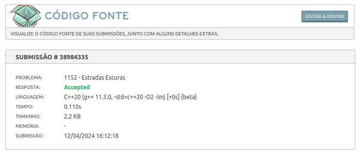

# Questões - Juíz Online

**Número da Lista**: X 
**Conteúdo da Disciplina**: Grafos 1 

## Alunos

| Matrícula  | Aluno                               |
| ---------- | ----------------------------------- |
| 21/1062016 | José André Rabelo Rocha |
| 20/0020323 | Jefferson Sena Oliveira         |

## Sobre

Descreva os objetivos do seu projeto e como ele funciona.

## Screenshots

#### Exercício 01 - Estradas Escuras

Dificuldade: Média - 5 
Descrição do Problema: [Estradas Escuras](https://judge.beecrowd.com/pt/problems/view/1152) 
Solução Proposta: [Código de Solução](https://github.com/projeto-de-algoritmos-2024/Grafos1_QuestoesJuizOnline/blob/master/Estradas_Escuras/estradas_escuras.cpp) 

No problema acima, resolvido em C++ ...

## Instalação

**Linguagem**: xxxxxx 
**Framework**: (caso exista) 
Descreva os pré-requisitos para rodar o seu projeto e os comandos necessários.

## Uso

Explique como usar seu projeto caso haja algum passo a passo após o comando de execução.

## Outros

Quaisquer outras informações sobre seu projeto podem ser descritas abaixo.
