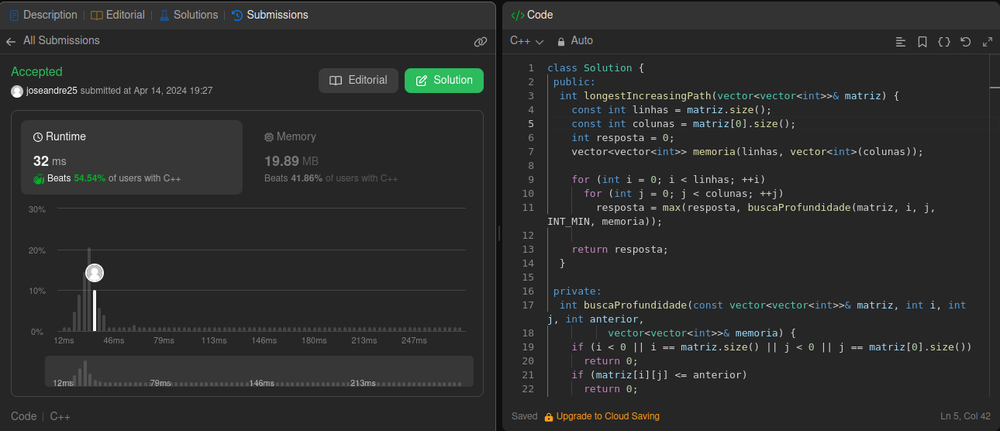
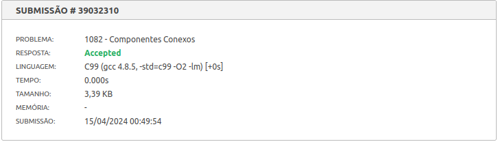

# Questões - Juíz Online

**Número da Lista**: X<br>
**Conteúdo da Disciplina**: Grafos 1<br>

## Alunos

| Matrícula  | Aluno                               |
| ---------- | ----------------------------------- |
| 21/1062016 | José André Rabelo Rocha |
| 20/0020323 | Jefferson Sena Oliveira         |

## Sobre

Este projeto consiste na realização de exercícios da plataforma de juiz online Beecrowd. São desenvolvidos problemas de média e alta
complexidade com ênfase em grafos. Os exercícios passaram nos casos de teste e na análise do site resultando em Accepted. 

## Screenshots

#### Exercício 01 - Longest Increasing Path in a Matrix

Dificuldade: Difícil <br>
Descrição do Problema: [Longest Increasing Path in a Matrix](https://leetcode.com/problems/longest-increasing-path-in-a-matrix/description/)<br>
Solução Proposta: [Código de Solução](https://github.com/projeto-de-algoritmos-2024/Grafos1_QuestoesJuizOnline/blob/master/Longest_Increasing_Path_Matrix/longest_increasing_path_matrix.cpp) 



#### Exercício 02 - Estradas Escuras

Dificuldade: Média<br>
Descrição do Problema: [Estradas Escuras](https://judge.beecrowd.com/pt/problems/view/1152)<br>
Solução Proposta: [Código de Solução](https://github.com/projeto-de-algoritmos-2024/Grafos1_QuestoesJuizOnline/blob/master/Estradas_Escuras/estradas_escuras.cpp) 


#### Exercício 03 - Movimentos do Cavalo

Dificuldade: Média<br>
Descrição do Problema: [Movimentos do Cavalo](https://judge.beecrowd.com/pt/problems/view/1100)<br>
Solução Proposta: [Código de Solução](https://github.com/projeto-de-algoritmos-2024/Grafos1_QuestoesJuizOnline/blob/master/Movimentos%20do%20Cavalo/movimentos_cavalo.c) 


#### Exercício 04 - Componentes Conexos

Dificuldade: Média<br>
Descrição do Problema: [Componentes Conexos](https://judge.beecrowd.com/pt/problems/view/1082)<br>
Solução Proposta: [Código de Solução](https://github.com/projeto-de-algoritmos-2024/Grafos1_QuestoesJuizOnline/blob/master/componentes_conectados/componentes_conexos.c) 



## Instalação

**Linguagem**: C, C++<br>
<!-- **Framework**: (caso exista)<br> -->
Descreva os pré-requisitos para rodar o seu projeto e os comandos necessários.

## Uso

Instruções para compilar e executar o código C++:

1. Certifique-se de ter um compilador para C, C++ instalado em sua máquina. Recomendamos o gcc.

2. Faça o clone do repositório Git para o seu ambiente local.

3. No terminal, navegue até o diretório onde está localizado o arquivo de código-fonte (.cpp ou .c) que deseja compilar.

4. - Compile o arquivo de código-fonte utilizando o seguinte comando:
```g++ -o <nome-do-executavel> <nome-do-arquivo.cpp>```
Substitua <nome-do-executavel> pelo nome desejado para o executável e <nome-do-arquivo.cpp> pelo nome do arquivo de código-fonte.
    - Para a execução em C: Compile o arquivo de código-fonte utilizando o seguinte comando:
```gcc <nome-do-arquivo.cpp> -o <nome-do-executavel> ```
Substitua <nome-do-executavel> pelo nome desejado para o executável e <nome-do-arquivo.cpp> pelo nome do arquivo de código-fonte.

5. Após a compilação bem-sucedida, execute o programa com o seguinte comando:
```./<nome-do-executavel>```
Certifique-se de estar no diretório correto em seu terminal para executar o programa.

6. Opcional: Deixamos arquivos de entrada para casos de teste (por exemplo, in.txt). Assim, você pode redirecionar a entrada para o programa durante a execução. Por exemplo:
```./<nome-do-executavel> < <nome-do-arquivo-de-input>.txt```

<!--## Outros

Quaisquer outras informações sobre seu projeto podem ser descritas abaixo.

-->
